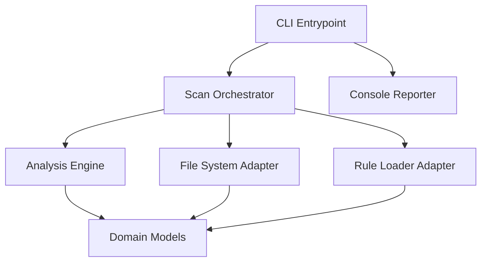

# Design: Sentinel CLI Core

## Overview

The Sentinel CLI Core is designed using Clean Architecture to ensure strict separation between external interfaces (CLI, Filesystem) and the core analysis logic. It utilizes a plugin-ready adapter pattern for file discovery and rule loading to support fully offline operation. The orchestration layer ensures that source files and YAML rules are aggregated before being processed by a pure domain-driven analysis engine, finally outputting results via a terminal-optimized reporter.

## Architecture

## Design Decisions

### CLI Termination Strategy

**Choice:** Standard Exit Codes (0: Success, 1: Violations, 2: Error)

**Rationale:** Enables seamless integration with CI/CD pipelines and pre-commit hooks (Requirement 3.0).

**Options Considered:** Always return 0 and log status, Standard UNIX exit codes

### Rule Loading Format

**Choice:** PyYAML with local schema validation

**Rationale:** YAML provides high readability for consultants while allowing offline validation against a local schema (Requirement 2.0).

**Options Considered:** JSON rules, YAML rules, Python-based rules

## Components

### ScanOrchestrator (usecases)

**File:** `src/usecases/scanner.py`

**Responsibilities:**
- Coordinate file discovery via adapters
- Invoke analysis engine with loaded rules
- Return findings to the interface layer

### LocalFileSystemAdapter (adapters)

**File:** `src/adapters/filesystem.py`

**Responsibilities:**
- Recursive directory traversal
- Reading rule files from disk
- Filtering files based on configuration

## Correctness Properties

- **F0a-P1: Air-Gapped Execution Integrity** — `For any run in a restricted environment, the system must perform all file scanning and rule processing using only local binary resources without reaching out to external networks, maintaining the integrity of requirement 4.0.`

## Error Scenarios

| Scenario | Exception | Handling |
|----------|-----------|----------|
| The user provides a non-existent directory or lacks read permissions. | FileNotFoundError / PermissionError | Catch exception, log descriptive error to stderr, and exit with code 2. |

## Testing Strategy

The strategy focuses on unit tests for the ScanOrchestrator using mocked file system adapters to verify logic flow. Integration tests will run against a 'test_fixtures' directory to ensure real-world directory traversal and YAML parsing work as expected. A dedicated suite of 'offline-check' tests will use network interception tools (like vcrpy or socket mocks) to guarantee no outbound traffic occurs during execution.
