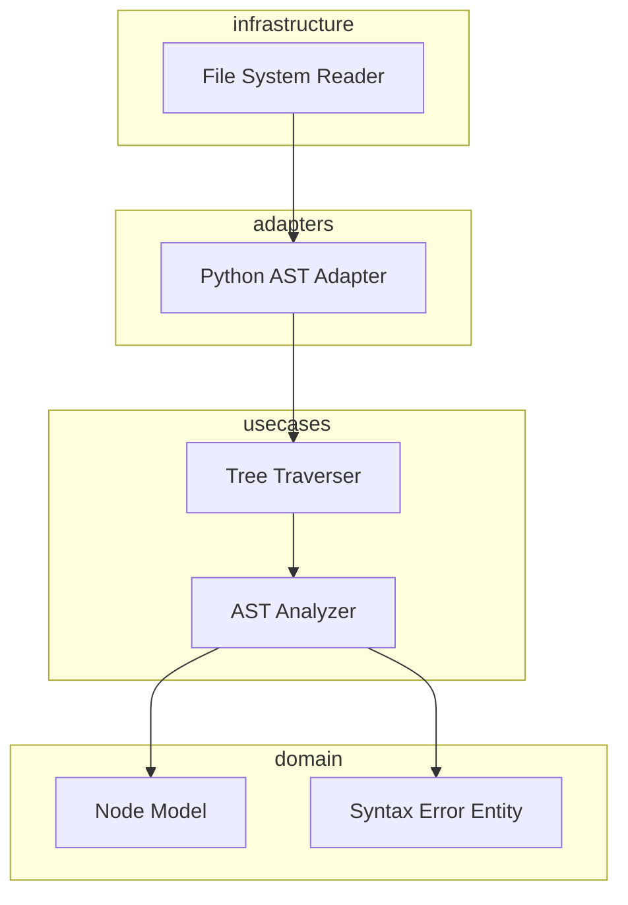

# Design: AST Parser Engine

## Overview

The AST Parser Engine is designed as a local-first, high-performance transformation system that converts Python source code into a navigable domain model. Following Clean Architecture, it isolates the parsing logic using the Python standard library 'ast' module within a dedicated adapter, ensuring all processing occurs in-memory without external API calls. This allows for deep structural analysis through a traversal interface while maintaining the speed required for iterative development.

## Architecture

## Design Decisions

### Choice of Parsing Library

**Choice:** Standard Library 'ast' Module

**Rationale:** The built-in 'ast' module provides the fastest parsing speeds for Python (milliseconds) without external dependencies, ensuring local-first execution and minimal overhead.

**Options Considered:** built-in ast module, tree-sitter, antlr4

### AST Processing Strategy

**Choice:** Visitor Pattern with Domain Mapping

**Rationale:** A Visitor pattern allows for clean navigation between code nodes (Req 4) while mapping native AST objects to Domain NodeModels to decouple application logic from the Python version.

**Options Considered:** Direct tree manipulation, Visitor Pattern, Text-based regex mapping

## Components

### NodeModel (domain)

**File:** `src/domain/node.py`

**Responsibilities:**
- Represent code structure abstractly
- Hold metadata like line numbers and scope

### PythonASTAdapter (adapters)

**File:** `src/adapters/python_parser.py`

**Responsibilities:**
- Convert raw source code into domain NodeModels
- Translate native syntax errors into domain-specific error objects
- Execute parsing in a local-only context

## Correctness Properties

- **F0b-P1: Local Semantic Integrity** — `For any valid Python source file provided to the engine, the resulting NodeModel tree must accurately reflect the structure of the input code without sending data to external networks.`

## Error Scenarios

| Scenario | Exception | Handling |
|----------|-----------|----------|
| Parsing an invalid Python file with broken indentation or syntax. | SyntaxError | Catch native SyntaxError and wrap into a domain SyntaxErrorEntity containing line/column data to be returned in the analysis result. |

## Testing Strategy

The testing strategy focuses on unit tests for the PythonASTAdapter using a suite of valid and invalid Python snippets to ensure 100% coverage of syntax error handling. Integration tests will verify that the Tree Traverser correctly identifies architectural patterns like private method calls across the generated NodeModel. Benchmark tests will be used to enforce the millisecond parsing performance requirement.
