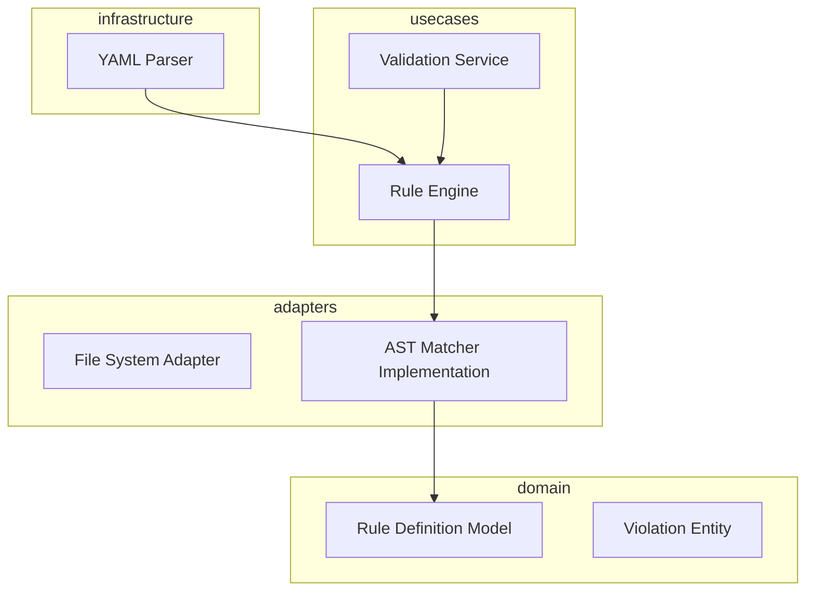

# Design: Custom Logic Rule Schema

## Overview

The Custom Logic Rule Schema feature is designed using a layered architecture to decouple rule definition from AST implementation. The system uses a domain-driven approach where rules are treated as first-class entities. A dedicated RuleEngine in the usecase layer orchestrates the matching process by coordinating between a YAML-to-Domain adapter and an AST-node-visitor implementation. This ensures that the logic for 'what' a rule is remains separate from 'how' it is detected in source code.

## Architecture

## Design Decisions

### Rule Definition Format

**Choice:** YAML + JSON Schema Validation

**Rationale:** YAML provides the best balance of human-readability for consultants and machine-readability for the parser. JSON Schema ensures the YAML adheres to the required structure before runtime.

**Options Considered:** JSON, YAML, Custom DSL

### AST Traversal Strategy

**Choice:** Visitor Pattern with Predicate Matching

**Rationale:** The Visitor pattern allows for deep inspection of specific node types (Class, Function) as required by 1.2, avoiding the high false-positive rate of regex.

**Options Considered:** Regex-based matching, XPath on XML-serialized AST, Visitor Pattern

## Components

### RuleDefinition (domain)

**File:** `src/domain/rules/RuleDefinition.ts`

**Responsibilities:**
- Defines the shape of a valid rule
- Enforces immutability of rule configurations

### RuleEngine (usecases)

**File:** `src/usecases/RuleEngine.ts`

**Responsibilities:**
- Iterates through AST nodes
- Evaluates pattern matching logic
- Generates Violations when patterns match

## Correctness Properties

- **F1-P1: Rule Fidelity and Enforcement** — `For any rule defined in YAML, the RuleEngine must produce a Violation object containing the exact custom message and severity level defined in the schema if the AST pattern matches.`

## Error Scenarios

| Scenario | Exception | Handling |
|----------|-----------|----------|
| A consultant provides a YAML file that is missing mandatory fields like 'severity' or 'pattern'. | InvalidRuleSchemaException | Catch during rule loading phase, log specific YAML line numbers and validation errors to stderr, and abort execution with exit code 1. |

## Testing Strategy

The testing strategy will focus on a pyramid approach. Unit tests in the domain layer will verify schema validation logic. Integration tests will use 'Golden Master' files consisting of sample YAML rules and snippets of code with intentional flaws to verify that RuleEngine correctly identifies AST nodes and maps messages (1.2, 1.3). Severity enforcement will be tested via end-to-end CLI simulations to ensure non-zero exit codes on 'error' severity.
