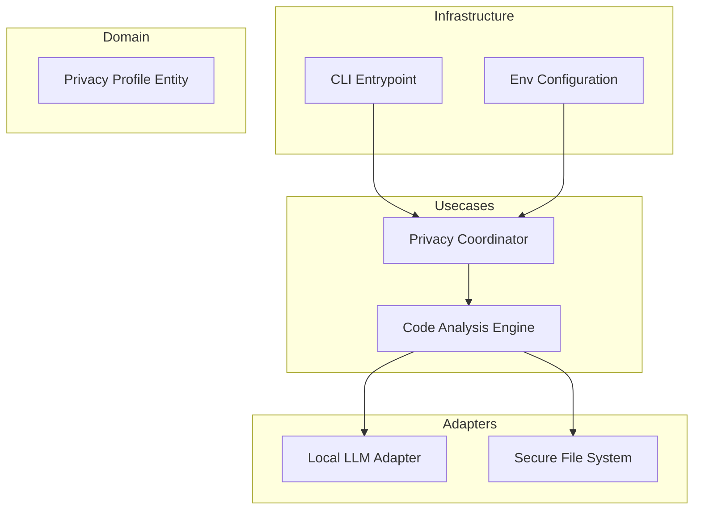

# Design: Air-Gapped Privacy Mode

## Overview

The Air-Gapped Privacy Mode is architected as a 'Strict-Local' execution path. It utilizes a PrivacyCoordinator in the usecases layer to preemptively disable any networking adapters (Telemetry, UpdateChecker, CloudLLM) and force the use of local-only resources. The system is packaged as a single standalone binary to ensure portability on restricted servers. At the domain level, a PrivacyProfile governs all logic, mandating that data flows never cross the boundary of the local process memory or defined secure local storage.

## Architecture

## Design Decisions

### Packaging Strategy for Air-Gapped Environments

**Choice:** PyInstaller for Standalone Executable

**Rationale:** Fulfill 1.2 by providing a single binary that includes all dependencies, requiring zero installation steps or external package managers.

**Options Considered:** Docker Containers, PyInstaller Standalone Binary, Shared Nix Environment

### Ensuring Zero Outbound Traffic

**Choice:** Hard-coded 'No-Op' for Update and Telemetry Services

**Rationale:** To meet requirements 1.3 and 1.4, the code path for updates and telemetry is physically removed or replaced with empty functions in Privacy Mode to prevent accidental activation.

**Options Considered:** Config-file based toggle, Functional override (No-Op) implementation

## Components

### PrivacyProfile (domain)

**File:** `src/domain/privacy_profile.py`

**Responsibilities:**
- Define mandatory offline constraints
- Represent telemetry suppression state

### PrivacyCoordinator (usecases)

**File:** `src/usecases/privacy_coordinator.py`

**Responsibilities:**
- Validate offline mode requirements
- Disable network-based update checks
- Enforce local-only model selection

### LocalLLMAdapter (adapters)

**File:** `src/adapters/local_llm_adapter.py`

**Responsibilities:**
- Interface with local model binaries
- Translate domain prompts to local engine formats

## Correctness Properties

- **F2-P1: Strict Network Isolation Isolation Verification** — `For any execution request where PrivacyMode is enabled, the system must verify the absence of socket connections to external IPs before processing any code, ensuring compliance with 1.1 and 1.3.`

## Error Scenarios

| Scenario | Exception | Handling |
|----------|-----------|----------|
| Application detects an attempt to resolve a DNS address or open a socket while in Air-Gapped Mode. | NetworkAccessAttemptedError | Immediately terminate analysis process, clear volatile memory, and log a critical security violation locally. |

## Testing Strategy

Testing will focus on 'Black-Box Network Auditing' where the binary is executed in a container with a simulated network gateway that triggers alerts on any outbound traffic. We will use Integration Tests to ensure the PrivacyCoordinator correctly rejects cloud-based LLM configurations, and Unit Tests to verify the Zero-Telemetry No-Op implementations. Coverage will prioritize the 100% suppression of outbound HTTP/S requests.
