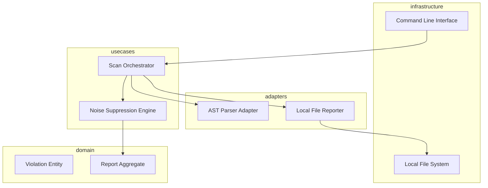

# Design: Zero-Noise Reporting Engine

## Overview

The Zero-Noise Reporting Engine is designed as a high-precision post-processor for AST matches. It utilizes a layered approach where raw scan results are passed through a suppression use-case that applies strictly defined structural heuristics to filter out non-critical linting artifacts. The architecture prioritizes local execution by embedding all reporting assets within the binary, ensuring full functionality in air-gapped environments while providing rich, terminal-based contextual snippets that bridge the gap between abstract syntax trees and human-readable source code.

## Architecture

## Design Decisions

### Define how to separate 'lint' from 'structural' flaws

**Choice:** Threshold-based Noise Suppression Meta-Filtering

**Rationale:** Heuristic-based scoring allows for high-precision filtering of known 'noise' patterns (like naming conventions) without the overhead or connectivity needs of ML models, supporting air-gapped use.

**Options Considered:** Manual exclusion lists, Heuristic-based severity scoring, ML-driven noise detection

### Reporting output format engine

**Choice:** Local-First Zero-Dependency Templating

**Rationale:** Using a zero-dependency local interpolation method ensures the engine works in secure, air-gapped environments without requiring external package mirrors or internet access.

**Options Considered:** Cloud-based Dashboard, External HTML Template Engine (Jinja2), In-house static string interpolation

## Components

### Noise Suppression EngineProxy (usecases)

**File:** `src/usecases/noise_filter.py`

**Responsibilities:**
- Evaluate violation confidence levels
- Filter out standard style-based warnings
- Prioritize critical logic errors (Requirement 3.2)

### Contextual Snippet Formatter (adapters)

**File:** `src/adapters/snippet_formatter.py`

**Responsibilities:**
- Extract code blocks from source using AST coordinates
- Format line and column pointers (Requirement 3.1)
- Apply terminal-safe highlighting (Requirement 3.3)

## Correctness Properties

- **F3-P1: AST Source Mapping Precision** — `For any AST violation detected, the reporting engine must map it to exact start/end line and column coordinates to ensure IDE navigation parity.`
- **F3-P2: Air-Gapped Isolation Maintenance** — `For any scan performed in an air-gapped environment, the engine must resolve all templates and dependencies locally without outbound network requests.`

## Error Scenarios

| Scenario | Exception | Handling |
|----------|-----------|----------|
| The source file was modified on disk between the parsing and reporting phase. | SourceMappingException | Degrade gracefully to file-level reporting and log a warning in the scan summary if specific AST nodes cannot be mapped back to lines. |

## Testing Strategy

Testing will focus on 'Gold File' comparison for report outputs to ensure no regressions in noise suppression logic. Unit tests in the use-case layer will mock AST nodes to verify coordinate mapping accuracy (Requirement 3.1). Integration tests will specifically target air-gapped scenarios by running the engine in a containerized environment with all outbound networking disabled to validate zero-dependency reporting (Requirement 3.4).
