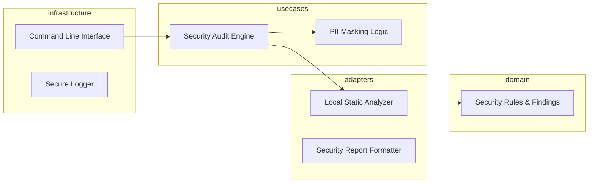

# Design: Security & API Integrity Rules

## Overview

The Security & API Integrity feature is built on a 'Local-First' architecture to ensure compliance with air-gapped security protocols. It utilizes Abstract Syntax Tree (AST) analysis to identify unauthorized private API calls and pattern-matching to detect sensitive data in logs. By avoiding dependency on external cloud security providers, the system ensures that sensitive client code never leaves the local environment. The usecase layer implements a high-precision filtering logic to minimize false positives, directly addressing the efficiency needs of high-stakes consultants.

## Architecture

## Design Decisions

### Security Scan Methodology

**Choice:** Local Regex and AST Parsing

**Rationale:** To meet the requirement for air-gapped environments (4.1), the scan must be performed locally without internet access. AST parsing allows for high-precision detection of private API calls (1.1, 3.1) compared to simple text search.

**Options Considered:** Cloud-based security APIs (Snyk/GitHub Advanced Security), Local Regex and AST Parsing, LLM-based remote scanning

### Precision Strategy

**Choice:** Allowlist-based False Positive Filtering

**Rationale:** Consultants require high-precision (3.1) to avoid time waste. An allowlist allows teams to mark specific legacy calls as 'safe' while flagging all other unauthorized private API usage (1.1).

**Options Considered:** Probabilistic ML classification, Strict Allowlist-based filtering

## Components

### LocalStaticAnalyzer (adapters)

**File:** `adapters/static_analyzer.py`

**Responsibilities:**
- Detect calls to restricted private libraries or APIs.
- Identify string patterns matching credentials or PII using local regex engines.
- Maintain zero-outbound connectivity during scans.

### SecurityAuditEngine (usecases)

**File:** `usecases/security_audit_engine.py`

**Responsibilities:**
- Aggregate findings from various scanners.
- Filter known false positives to ensure high precision.
- Generate structured security audit reports.

## Correctness Properties

- **F4-P1: Air-Gapped Isolation Execution** — `For any security audit performed, the system must execute the scan using only local resources without external API calls to satisfy air-gapped requirements (4.1).`
- **F4-P2: Detection of Unmasked Sensitive Data** — `For any detected logging statement, the system must trigger a masking alert if it contains tokens matching the PII/Credential regex database to satisfy data masking requirements (2.1).`

## Error Scenarios

| Scenario | Exception | Handling |
|----------|-----------|----------|
| The security scanner detects an attempt by a dependency to make an outbound network call in an air-gapped environment. | RestrictedEnvironmentException | Abort operation immediately and output a localized error log to a secure file. Do not attempt to retry via network. |

## Testing Strategy

Testing will focus on 'Black-Box' architectural validation to ensure no network sockets are opened during a scan. Unit tests will involve 'Synthetic Vuln' files containing known private API calls and unmasked credentials to ensure 100% recall of the rule engine. Integration tests will simulate air-gapped constraints by disabling loopback and external interfaces during the test suite execution.
