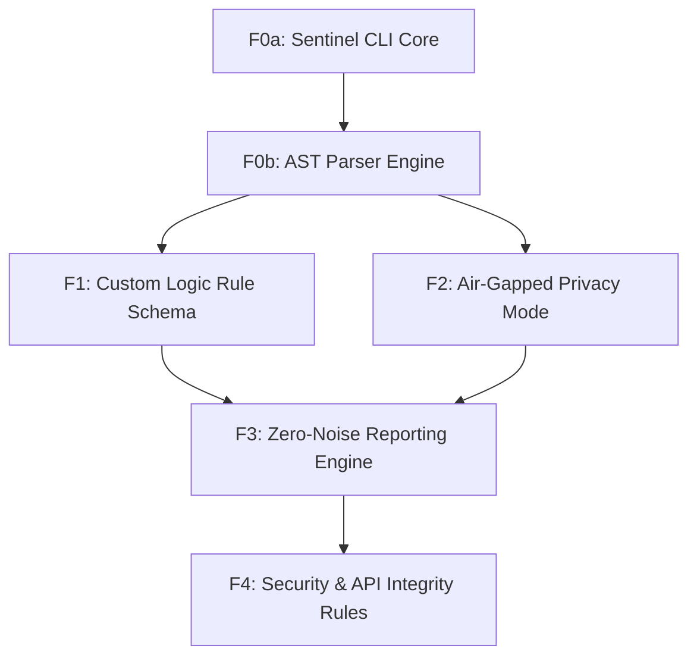

# Feature Map

## Features

| ID | Name | Type | Size | Dependencies |
|----|------|------|------|--------------|
| F0a | Sentinel CLI Core | foundation | small | — |
| F0b | AST Parser Engine | foundation | medium | F0a |
| F1 | Custom Logic Rule Schema | product | large | F0b |
| F2 | Air-Gapped Privacy Mode | product | medium | F0b |
| F3 | Zero-Noise Reporting Engine | product | medium | F1, F2 |
| F4 | Security & API Integrity Rules | product | medium | F3 |

## Milestones

### M0: Foundational Engine

**Goal:** Establish the local-first execution environment and code parsing capabilities.

**Exit Criteria:**
- CLI successfully traverses a directory and parses all .py files without errors.
- AST nodes are accessible for internal analysis functions.

**Features:** F0a, F0b

### M1: V1.0 High-Precision Logic Engine

**Goal:** Deliver a functional high-precision logic engine for local architectural enforcement.

**Exit Criteria:**
- Users can define a rule in YAML and have it trigger on specific code patterns.
- Zero-noise output is achieved with zero internet connectivity.

**Features:** F1, F2, F3, F4

## Dependency Graph

